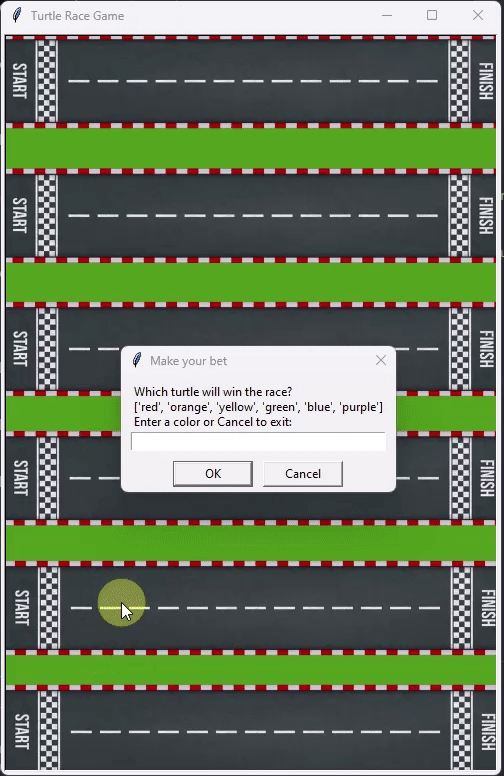
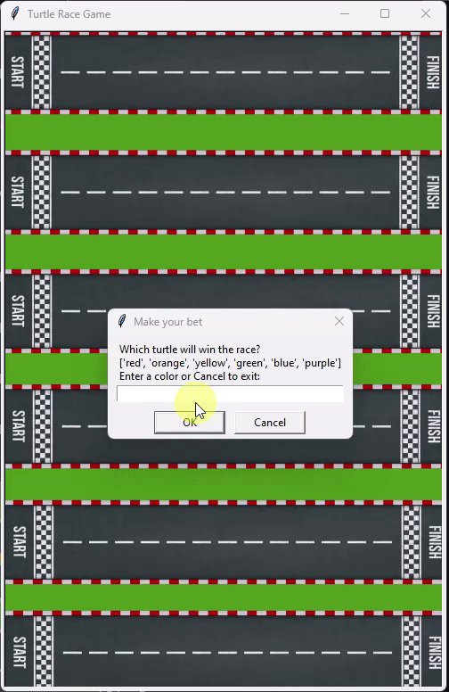

# Turtle Race Game
A simple Turtle Race Game using Python.

## How to play
The game requires Python 3 installed.

Clone the repo and launch the game using the following command:

```
python main.py
```

Then follow the game instruction to play.

At the end of the game, program will ask if user wants to play again or stop the game.

## Game demo
### Demo exit game:



### Demo continue game:

