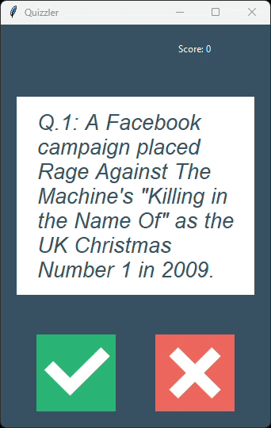

# Quizzler App

A desktop True/False quiz app built with Python and tkinter.

The app fetches 10 boolean questions from the Open Trivia Database API, displays them in a card-style interface, and tracks the score as you answer.

## Features

- GUI quiz interface built with tkinter
- True/False answer buttons with image assets
- Live score updates
- Visual feedback:
  - Green card for correct answers
  - Red card for incorrect answers
- 1-second delay before loading the next question
- Questions fetched dynamically from API
- HTML entities in question text are safely decoded

## Project Structure

- `main.py`: App entry point and object wiring
- `ui.py`: tkinter UI and interaction logic
- `quiz_brain.py`: Quiz state, scoring, and answer checking
- `question_model.py`: Question data model
- `data.py`: API request logic for quiz questions
- `images/`: Button image assets

## Requirements

- Python 3.8+
- requests
- Internet connection (for fetching questions)

## Installation

1. Open a terminal in this folder.
2. Install dependency:

   `pip install requests`

## Run

Use:

`python main.py`

### Demo

## How It Works

1. `data.py` requests 10 True/False questions from OpenTDB.
2. `main.py` converts response items to `Question` objects.
3. `QuizBrain` manages the current question index and score.
4. `QuizInterface` displays each question and accepts button input.
5. After each answer, the canvas flashes color feedback and advances after 1 second using `window.after(...)`.

## Notes

- If the API is unreachable, the app will fail when importing `data.py` because questions are loaded at startup.
- The score label shows current points, and final score appears when questions are exhausted.
