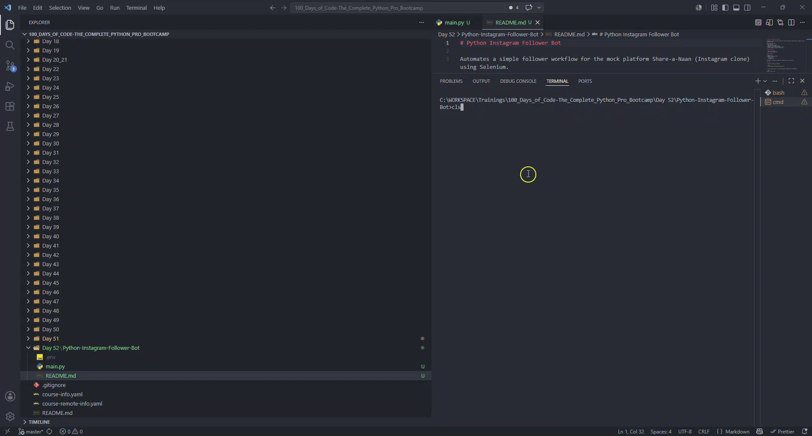

# Python Instagram Follower Bot

Automates a simple follower workflow for the mock platform Share-a-Naan (Instagram clone) using Selenium.

The script does this:
- Opens Chrome
- Logs into Share-a-Naan
- Navigates to a target account
- Opens and scrolls the followers modal
- Clicks Follow on visible follower rows

## Demo



## Project Files

- main.py: bot logic
- .env: local credentials
- demo/IG_bot_demo.gif: short demo recording

## Requirements

- Python 3.9+
- Google Chrome installed
- Python packages:
  - selenium
  - python-dotenv

Selenium 4 can manage ChromeDriver automatically in most setups.

## Setup

1. Open this folder in terminal:

```bash
cd "Day 52/Python-Instagram-Follower-Bot"
```

2. Create and activate a virtual environment (optional but recommended):

```bash
python -m venv .venv
```

Windows (PowerShell):

```powershell
.\.venv\Scripts\Activate.ps1
```

macOS/Linux:

```bash
source .venv/bin/activate
```

3. Install dependencies:

```bash
pip install selenium python-dotenv
```

4. Create or update .env in this folder:

```env
SHARE-A-NAAN_USERNAME=your_email@example.com
SHARE-A-NAAN_PASSWORD=your_password
```

## Run

```bash
python main.py
```

## Configuration

In main.py:
- SIMILAR_ACCOUNT controls which account followers are loaded from.
- BASE_URL points to the Share-a-Naan mock service.

## Current Behavior Notes

- The follower modal is scrolled a fixed number of times (currently 5).
- The follow step only clicks buttons currently loaded in the DOM after scrolling.
- If an unfollow confirmation popup appears, the bot cancels it and continues.

## Troubleshooting

- Browser opens then closes immediately:
  - Check Python exceptions in terminal.
  - Confirm Chrome is installed and up to date.

- Login fails:
  - Verify .env values and variable names.
  - Confirm credentials are valid for the mock site.

- No users followed:
  - The modal may not have loaded enough entries yet.
  - Increase the scroll loop count in find_followers().

- Element not found / intercepted:
  - UI timing can vary; increase wait times or add waits around unstable steps.

## Security

- Do not commit real credentials.
- Keep .env private and add it to .gitignore if this project is shared.

## Disclaimer

This project is for learning browser automation in a controlled practice environment.